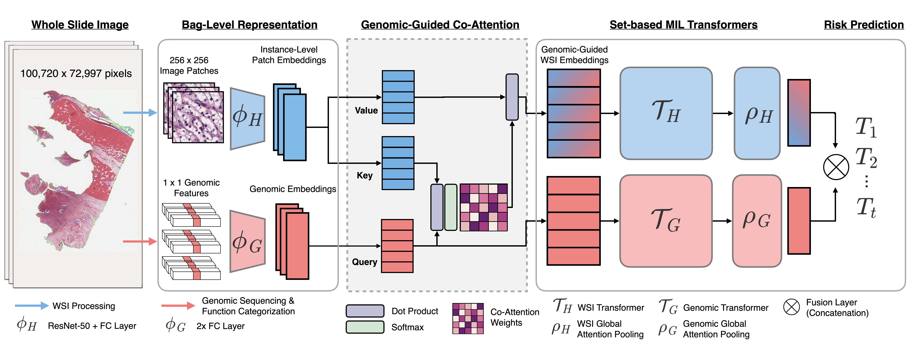

Multimodal Co-Attention Transformer (MCAT) for Survival Prediction in Gigapixel Whole Slide Images
===========
<details>
<summary>
  <b>Multimodal Co-Attention Transformer for Survival Prediction in Gigapixel Whole Slide Images</b>, ICCV 2021.
  <a href="https://openaccess.thecvf.com/content/ICCV2021/html/Chen_Multimodal_Co-Attention_Transformer_for_Survival_Prediction_in_Gigapixel_Whole_Slide_ICCV_2021_paper.html" target="blank">[HTML]</a>
  <br><em>Richard J Chen, Ming Y Lu, Wei-Hung Weng, Tiffany Y Chen, Drew FK Williamson, Trevor Manz, Maha Shady, Faisal Mahmood</em></br>
</summary>

```bash
@inproceedings{chen2021multimodal,
  title={Multimodal Co-Attention Transformer for Survival Prediction in Gigapixel Whole Slide Images},
  author={Chen, Richard J and Lu, Ming Y and Weng, Wei-Hung and Chen, Tiffany Y and Williamson, Drew FK and Manz, Trevor and Shady, Maha and Mahmood, Faisal},
  booktitle={Proceedings of the IEEE/CVF International Conference on Computer Vision},
  pages={4015--4025},
  year={2021}
}
```
</details>

**Summary:** We develop a method for performing early fusion between histology and genomics via: 1) formulating both WSIs and genomic inputs as embedding-like structures, 2) using co-attention mechanism that learns pairwise interactions between instance-level histology patches and genomic embeddings. In addition, we make connections between MIL and Set Transformers, and adapt Transformer Attention to WSIs for learning long-range dependencies for survival outcome prediction.



## Updates:
* 11/12/2021: Several users have raised concerns about the low c-Index for GBMLGG in SNN (Genomic Only). In using the gene families from MSigDB as gene signatures, IDH1 mutation was not included (key biomarker in distinguishing GBM and LGG).
* 06/18/2021: Updated [data preprocessing section](https://github.com/iccv2021anon/10972/blob/master/docs/README.md#3-molecular-features-and-genomic-signatures) for reproducibility.
* 06/17/2021: Uploaded predicted risk scores on the validation folds for each models, and the evaluation script to compute the c-Index and Integrated AUC (I-AUC) validation metrics, found using the [following Jupyter Notebook](https://github.com/iccv2021anon/10972/blob/master/Evaluation.ipynb). Model checkpoints for MCAT are uploaded in the results directory.
* 06/17/2021: Uploaded notebook detailing the MCAT network architecture, with sample input in the following [following Jupyter Notebook](https://github.com/iccv2021anon/10972/blob/master/Model%20Computation%20%2B%20Complexity%20Overview.ipynb), in which we print the shape of the tensors at each stage of MCAT.


## Installation Guide for Linux (using anaconda)

### Pre-requisites:
* Linux (Tested on Ubuntu 18.04) 
* NVIDIA GPU (Tested on Nvidia GeForce RTX 2080 Ti x 16) with CUDA 11.0 and cuDNN 7.5
* Python (3.7.7), h5py (2.10.0), matplotlib (3.1.1), numpy (1.18.1), opencv-python (4.1.1), openslide-python (1.1.1), openslide (3.4.1), pandas (1.1.3), pillow (7.0.0), PyTorch (1.6.0), scikit-learn (0.22.1), scipy (1.4.1), tensorflow (1.13.1), tensorboardx (1.9), torchvision (0.7.0), captum (0.2.0), shap (0.35.0)

### Downloading TCGA Data
To download diagnostic WSIs (formatted as .svs files), molecular feature data and other clinical metadata, please refer to the [NIH Genomic Data Commons Data Portal](https://portal.gdc.cancer.gov/) and the [cBioPortal](https://www.cbioportal.org/). WSIs for each cancer type can be downloaded using the [GDC Data Transfer Tool](https://docs.gdc.cancer.gov/Data_Transfer_Tool/Users_Guide/Data_Download_and_Upload/).

## Processing Whole Slide Images
To process WSIs, first, the tissue regions in each biopsy slide are segmented using Otsu's Segmentation on a downsampled WSI using OpenSlide. The 256 x 256 patches without spatial overlapping are extracted from the segmented tissue regions at the desired magnification. Consequently, a pretrained truncated ResNet50 is used to encode raw image patches into 1024-dim feature vectors, which we then save as .pt files for each WSI. The extracted features then serve as input (in a .pt file) to the network. The following folder structure is assumed for the extracted features vectors:    
```bash
DATA_ROOT_DIR/
    └──TCGA_BLCA/
        ├── slide_1.pt
        ├── slide_2.pt
        └── ...
    └──TCGA_BRCA/
        ├── slide_1.pt
        ├── slide_2.pt
        └── ...
    └──TCGA_GBMLGG/
        ├── slide_1.pt
        ├── slide_2.pt
        └── ...
    └──TCGA_LUAD/
        ├── slide_1.ptd
        ├── slide_2.pt
        └── ...
    └──TCGA_UCEC/
        ├── slide_1.pt
        ├── slide_2.pt
        └── ...
    ...
```
DATA_ROOT_DIR is the base directory of all datasets / cancer type(e.g. the directory to your SSD). Within DATA_ROOT_DIR, each folder contains a list of .pt files for that dataset / cancer type.


## Molecular Features and Genomic Signatures
Processed molecular profile features containing mutation status, copy number variation, and RNA-Seq abundance can be downloaded from the [cBioPortal](https://www.cbioportal.org/), which we include as CSV files in the [following directory](https://github.com/iccv2021anon/10972/tree/master/datasets_csv_sig). For ordering gene features into gene embeddings, we used the following categorization of gene families (categorized via common features such as homology or biochemical activity) from [MSigDB](https://www.gsea-msigdb.org/gsea/msigdb/gene_families.jsp?ex=1). Gene sets for homeodomain proteins and translocated cancer genes were not used due to overlap with transcription factors and oncogenes respectively. The curation of "genomic signatures" can be modified to curate genomic embedding that reflect unique biological functions.


## Training-Validation Splits
For evaluating the algorithm's performance, we randomly partitioned each dataset using 5-fold cross-validation. Splits for each cancer type are found in the [splits/5foldcv](https://github.com) folder, which each contain **splits_{k}.csv** for k = 1 to 5. In each **splits_{k}.csv**, the first column corresponds to the TCGA Case IDs used for training, and the second column corresponds to the TCGA Case IDs used for validation. Alternatively, one could define their own splits, however, the files would need to be defined in this format. The dataset loader for using these train-val splits are defined in the [**get_split_from_df**](https://github.com) function in the [**Generic_WSI_Survival_Dataset**](https://github.com) class (inherited from the PyTorch Dataset class).

## Running Experiments
To run experiments using the SNN, AMIL, and MMF networks defined in this repository, experiments can be run using the following generic command-line:
```shell
CUDA_VISIBLE_DEVICES=<DEVICE ID> python main.py --which_splits <SPLIT FOLDER PATH> --split_dir <SPLITS FOR CANCER TYPE> --mode <WHICH MODALITY> --model_type <WHICH MODEL>
```
Commands for all experiments / models can be found in the [Commands.md](https://github.com) file.

## Issues
- Please open new threads or report issues directly (for urgent blockers) to richardchen@g.harvard.edu.
- Immediate response to minor issues may not be available.

## License & Usage 
If you find our work useful in your research, please consider citing our paper at:
```bash
@inproceedings{chen2021multimodal,
  title={Multimodal Co-Attention Transformer for Survival Prediction in Gigapixel Whole Slide Images},
  author={Chen, Richard J and Lu, Ming Y and Weng, Wei-Hung and Chen, Tiffany Y and Williamson, Drew FK and Manz, Trevor and Shady, Maha and Mahmood, Faisal},
  booktitle={Proceedings of the IEEE/CVF International Conference on Computer Vision},
  pages={4015--4025},
  year={2021}
}
```

© [Mahmood Lab](http://www.mahmoodlab.org) - This code is made available under the GPLv3 License and is available for non-commercial academic purposes. 
